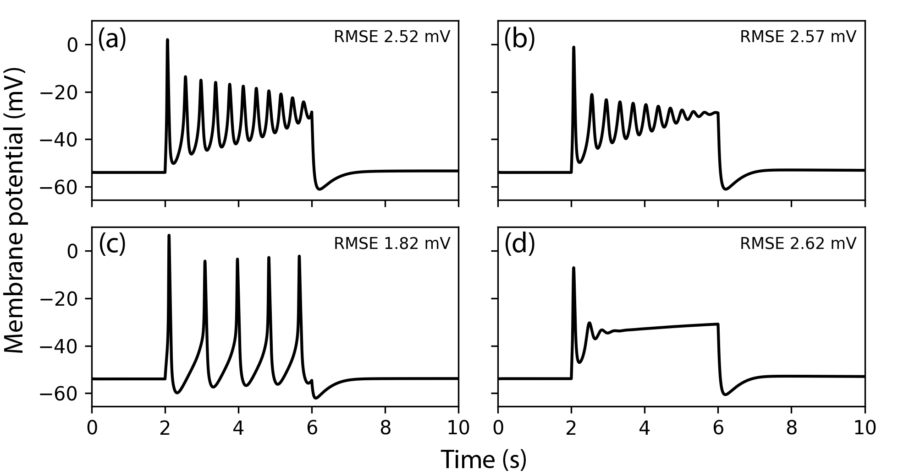
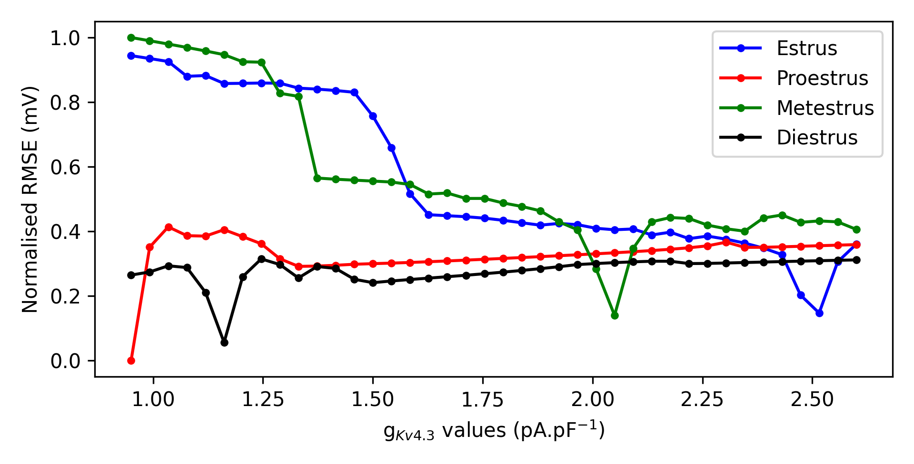
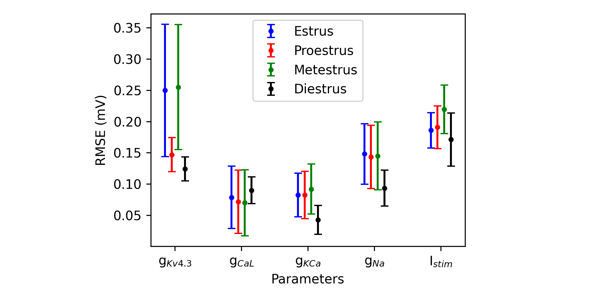

# Uterine smooth muscle model conversion

# Table of contents
1. [General description](#general)
2. [Requirements](#requirements)
3. [Usage](#usage)
	1. [Setup](#setup)
	2. [Running the code](#code)
		1. [***PNP-comp.py*** script](#pnp)
		2. [***param-sweep.py*** script](#sweep)
		3. [***sensitivity.py*** script](#sense)
	3. [Example workflow](#workflow)
4. [Results](#results)

<a id="general"></a>
## General description
This project focuses on comparing results from a pregnant and a non-pregnant uterine smooth muscle cell model and was used to generate results for an EMBC article. 

The project is structure as follows:
```
uSMC-conversion/ (top-level directory)
|-- cells/ (contains the cellML implementations)
|-- scripts/ (contains the Python scripts)
|-- conversion/ (contains the conversion module)
|-- res/ (contains simulation outputs)
```

<a id="requirements"></a>
## Requirements
The code was run on Linux Ubuntu 22.04.2 LTS\
The code was developed in [Python](https://www.python.org/) version 3.10.12\
The required packages for Python are found in requirements.txt


<a id="usage"></a>
## Usage

<a id="setup"></a>
### Setup 
First clone the project into *uSMC-conversion* and enter the new directory:
```bash
$ git clone git@github.com/mathiasroesler/uSMC-conversion.git
$ cd uSMC-conversion
```

It is recommended to create a virtual environment in which to run the code. Navigate into the directory where you want the virtual environment to reside, for example:
```bash
$ cd ~/venv
```

Next, create a virtual environment and activate it:
```bash
$ python3 -m venv conversion-env
$ source ~/venv/conversion-env/bin/activate
```

Now navigate to the project directory and install the conversion module with the following commands:
```bash
$ cd /path/to/uSMC-conversion/
$ pip3 install -e .
```

Finally, create the *res/* directory in the uSMC-conversion directory to store the results in:
```bash
$ mkdir res
```

<a id="code"></a>
### Running the code
There are three scripts that can be run, contained in the *scripts/* directory: 
* ***PNP-comp.py***
* ***param-sweep.py***
* ***sensitivity.py***

<a id="pnp"></a>
#### ***PNP-comp.py*** script
The ***PNP-comp.py*** compares the simulation outputs of the pregnant and the non-pregnant cell models. The script has one positional argument, **metric**, that selects the comparison metric to use. Currently, the options are:
* **mae**, for Mean Absolute Error
* **rmse**, for Root Mean Squared Error
* **l2**, for L2-norm

There are also two optional flags:
* **-m**, use to only compute the metric and plot the results
* **-p**, use to only plot the results

**Note:** the script needs to be run once without any flags before being able to use the **-m** and **-p** flags.

When run with no flags, the script will generate two .pkl files in the *res/* directory:
* **sim_output.pkl**, which contains a dictionary with the time steps (in seconds) and the membrane potential values for the pregnant model and each stage of the estrus cycle (in mV)
* **metric_comp.pkl**, where metric is replaced with one of the metrics, which contains the comparison value between the pregnant and non-pregnant model

The **sim_output.pkl** file is required to use the **-m** flag and generate a  **metric_comp.pkl** file. Both of these files are needed to use the **-p** flag. 

**Note:** the estrus stages are always in the same order: proestrus, estrus, metestrus, diestrus.

Run the following command from inside the *scripts/* directory to view the help message:
```bash
$ python3 PNP-comp.py -h
```


<a id="sweep"></a>
#### ***param-sweep.py*** script
The ***param-sweep.py*** performs a parameter sweep for a given parameter and uses the provided metric to compare the results with the default simulation of the non-pregnant or pregnant model at the same estrus stage. The script has three positional arguments:
* **param**, the name of the parameter to change, if the specified parameter is not in the parameter list, an error is thrown
* **metric**, the metric to use for comparison (the options can be found in the [***PNP-comp.py***](#pnp) description)
* **model**, the name of the model to compare to either Means (pregnant) or Roesler (non-pregnant)

The script has two sub-commands: **sweep** and **plot**.
The **sweep** sub-command computes the results for different values of the given parameter **param**. It has three positional arguments:
* **start-val**, the value at which to start the sweep
* **end-val**, the value at which to end the sweep
* **nb-points**, the number of simulations to run over the range given by **end-va** - **start-val**

The optional flag **--estrus** can be used to compute the sweep for a single estrus stage. The default value is all which computes the sweep for all four stages. 

The **sweep** sub-command will generate .pkl files in the *res/* directory with the following structure **param_stage_metric_sweep.pkl**, where param is replaced with the name of the parameter, stage is replaced with the estrus stage, and metric is replaced with the name of the used metric. The results will be plotted if the **--estrus** flag is set to all.

The **plot** sub-command plots the results without running the parameter sweep again. It can only be called after the **sweep** command has been used and the .pkl files have been generated. 

Run the following command from inside the *scripts/* directory to view the help message:
```bash
$ python3 param-sweep.py -h
```

An example of the **sweep** command for 10 values of the gkv43 parameter with the RMSE metric for all stages of the estrus cycle compared with the pregnant model output:
```bash
$ python3 param-sweep gkv43 rmse Means sweep 1.2 2.6 10
```

An example of the **plot** command for the gkv43 parameter with the RMSE metric:
```bash
$ python3 param-sweep gkv43 rmse Means plot
```

<a id="sense"></a>
#### ***sensitivity.py*** script

The ***sensitivity.py*** can only be run once the parameter sweeps for every parameter at every estrus stage have been computed with a given metric. The script will plot the average value of the metric and use the standard deviation as error bars to provide an insight on how sensitive the model is for each parameter at different estrus stages. The script has one positional argument, **metric**, the metric to use for comparison (the options can be found in the [***PNP-comp.py***](#pnp) description)


<a id="workflow"></a>
### Example workflow 
The following set of instructions are an example of how to use the different scripts to generate the sensitivity analysis results. They assume that the [setup](#setup) has been completed.

Navigate to the *scripts/* directory from the uSMC-conversion directory:
```
$ cd script
```

Run the [***PNP-comp.py***](#pnp) script to view the output of the pregnant and non-pregnant models using the RMSE metric:
```
$ python3 PNP-comp.py rmse
```
**Note:** the **-p** and **-m** flags of the [***PNP-comp.py***](#pnp) script can now be used.

Use the [***param-sweep.py***](#sweep) script to run the parameter sweeps for all four parameters. The ranges provided here compute 20 simulations for each parameter at each stage comparing to the default non-pregnant output using the RMSE metric:
```
$ python3 param-sweep.py gcal rmse Roesler sweep 0.17 0.6 20
$ python3 param-sweep.py gna rmse Roesler sweep 0.014 0.0625 20
$ python3 param-sweep.py gkca rmse Roesler sweep 2.0 3.0 20
$ python3 param-sweep.py gkv43 rmse Roesler sweep 1.2 2.6 20
```
**Note:** the plot sub-command of the [***param-sweep.py***](#sweep) script can now be used.

Plot the sensitivity analysis results with the [***sensitivity.py***](#sense) script:
```
$ python3 senstivitiy.py rmse
```


<a id="results"></a>
## Results
Below is the plot generated from the [***PNP-comp.py***](#pnp) script using the RMSE metric to compare the simulation outputs of the pregnant model with the non-pregnant model. (a) proestrus, (b) estrus) (c) metestrus, and (d) diestrus. 


Below is the plot generated from the [***param-sweep.py***](#sweep) script for the gkv43 parameter with the RMSE metric which compares the simulation output of the non-pregnant model with different values of gkv43 with the default value at all stages of the estrus cycle.


Below is the plot generated from the [***sensitivity.py***](#sense) with the RMSE metric which plots the mean value of the metric and the standard deviation for each parameter sweep at every stage of the estrus.
